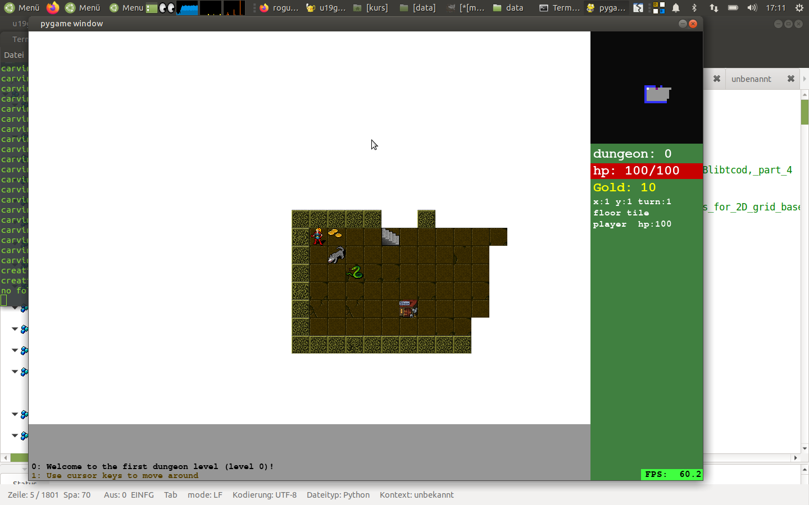

# roguebasin_python3

## Installationsanleitung

python3 installieren von http://www.python.org

pygame installieren von http://pygame.org 
(unter linux: ''sudo pip3 install pygame'')

spiel starten: ''python u19game.py''
