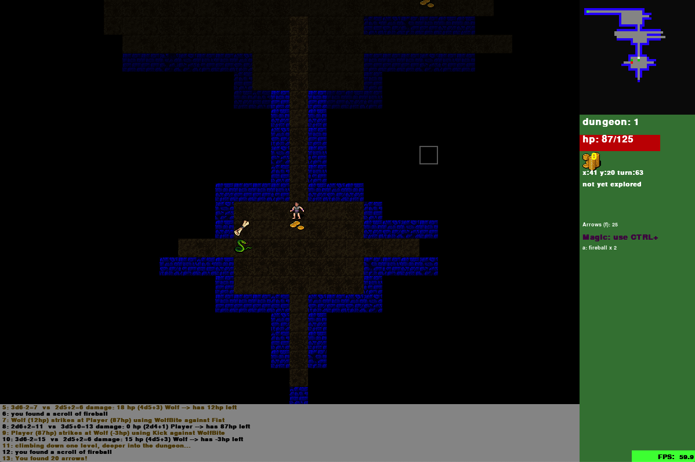
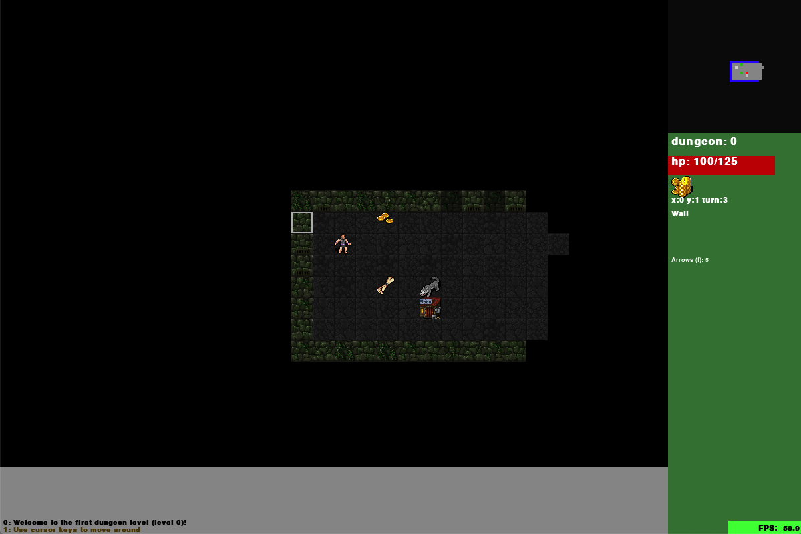
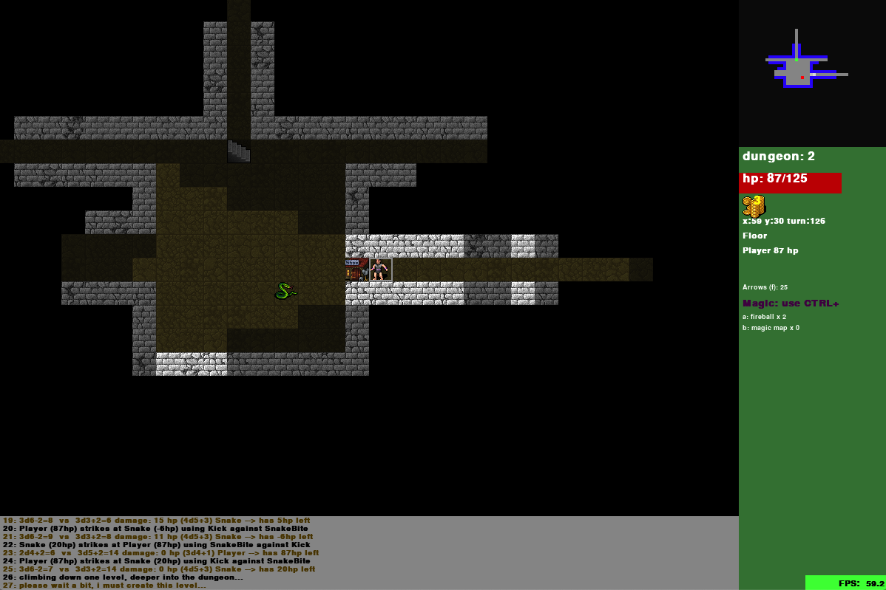

# PyDungeon

## Installationsanleitung

Bitte python3 installieren von http://www.python.org

pygame installieren von http://pygame.org 
(unter linux: ''sudo pip3 install pygame'')

Bitte spiel starten: ''python u19game.py''

## Ziel des Spiels
Es gilt den Dungeon 15 zu erreichen, ohne dass die Lebenspunkte ausgehen.
Lebenspunkte erhält man durch einen Zauberspruch oder durch Kauf im Shop mit Gold, das man finden kann.
Man verliert Lebenspunkte durch die Gegner.
Über die Stiegen kommt man von einem Dungeon zum nächsten.

## Steuerung

Den Spieler bewegt man mit den Pfeiltasten. Er steht immer in der Mitte.
Den Cursor (helles Quadrat) bewegt man mit der Computermaus.
Mit dem Cursor kann man Informationen über Objekte in der Umgebung einholen.
Die Stiegen benützt man mit < >.
Beim Shop kann man mit der Leertaste für 1 Gold 10 hitpoints (hp) kaufen.

## Gegner

Wolf
Schlange
Yeti
Drache

## Objekte

Shop: Ein Gebäude bei dem man sich mit der Leertaste für 1 Gold 10 hitpoints (hp) kaufen kann.
Gold: Die Währung, die man im Shop ausgeben kann.
Schriftrolle: Eine Papierrolle mit einem Zauber.
Stiegen: Mit ihnen kann man Dungeon wechseln.

## Geschichte

In dem Spiel gibt es einen kleinen Jungen, der sehr einsam ist und
von anderen Kindern ausgeschlossen wird. Doch in seinen Träumen ist 
er ein mutiger und starker und Held. Er kämpft in diesen 
mysteriösen Träumen mit den verschiedensten Gegnern.

## Zaubersprüche

Wenn man gleichzeitig CTRL und die jeweilige Taste drückt macht man einen Zauberspruch.
Es gibt zwei verschiedene Arten von Zaubersprüchen. Die erste Gruppe von Zaubersprüchen sind zu 
deinem Wohl. Die anderen sind schaden dem Gegner.

1. Zaubersprüche für dich:
Blink: Man teleportiert sich. geht nur bei erleuchteten Feldern.
Magic map: Die ganze Karte wird enthüllt
Heal: Man heilt sich 20 hp. Dies geht über das Limit der hp.

2. Zaubersprüche gegen den Gegner:
Magic missile: eine Kugel die 20 Schaden macht.
Bleed: Der Gegner bekommt 20 Schaden. Dies geht auch durch die Wand.
Fireball: Ein Ball welcher dem Gegner 10 Schaden macht.

